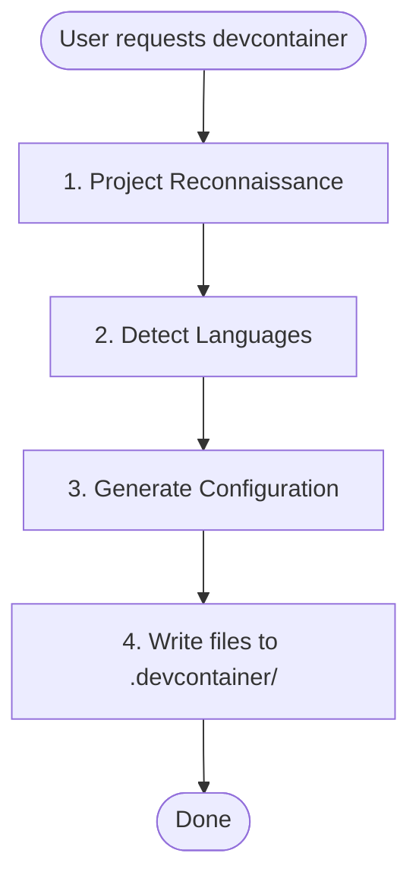

# Devcontainer Setup Skill

Creates a pre-configured devcontainer with Claude Code and language-specific tooling.

## When to Use

- User asks to "set up a devcontainer" or "add devcontainer support"
- User wants a sandboxed Claude Code development environment
- User needs isolated development environments with persistent configuration

## When NOT to Use

- User already has a devcontainer configuration and just needs modifications
- User is asking about general Docker or container questions
- User wants to deploy production containers (this is for development only)

## Workflow



## Phase 1: Project Reconnaissance

### Infer Project Name

Check in order (use first match):

1. `package.json` → `name` field
2. `pyproject.toml` → `project.name`
3. `Cargo.toml` → `package.name`
4. `go.mod` → module path (last segment after `/`)
5. Directory name as fallback

Convert to slug: lowercase, replace spaces/underscores with hyphens.

### Detect Language Stack

| Language | Detection Files |
|----------|-----------------|
| Python | `pyproject.toml`, `*.py` |
| Node/TypeScript | `package.json`, `tsconfig.json` |
| Rust | `Cargo.toml` |
| Go | `go.mod`, `go.sum` |

### Multi-Language Projects

If multiple languages are detected, configure all of them in the following priority order:

1. **Python** - Primary language, uses Dockerfile for uv + Python installation
2. **Node/TypeScript** - Uses devcontainer feature
3. **Rust** - Uses devcontainer feature
4. **Go** - Uses devcontainer feature

For multi-language `postCreateCommand`, chain all setup commands:
```
uv run /opt/post_install.py && uv sync && npm ci
```

Extensions and settings from all detected languages should be merged into the configuration.

## Phase 2: Generate Configuration

Start with base templates from `resources/` directory. Substitute:

- `{{PROJECT_NAME}}` → Human-readable name (e.g., "My Project")
- `{{PROJECT_SLUG}}` → Slug for volumes (e.g., "my-project")

Then apply language-specific modifications below.

## Base Template Features

The base template includes:

- **Claude Code** with marketplace plugins (anthropics/skills, trailofbits/skills)
- **Python 3.13** via uv (fast binary download)
- **Node 22** via fnm (Fast Node Manager)
- **ast-grep** for AST-based code search
- **Network isolation tools** (iptables, ipset) with NET_ADMIN capability
- **Modern CLI tools**: ripgrep, fd, fzf, tmux, git-delta

---

## Language-Specific Sections

### Python Projects

**Detection:** `pyproject.toml`, `requirements.txt`, `setup.py`, or `*.py` files

**Dockerfile additions:**

The base Dockerfile already includes Python 3.13 via uv. If a different version is required (detected from `pyproject.toml`), modify the Python installation:

```dockerfile
# Install Python via uv (fast binary download, not source compilation)
RUN uv python install <version> --default
```

**devcontainer.json extensions:**

Add to `customizations.vscode.extensions`:
```json
"ms-python.python",
"ms-python.vscode-pylance",
"charliermarsh.ruff"
```

Add to `customizations.vscode.settings`:
```json
"python.defaultInterpreterPath": ".venv/bin/python",
"[python]": {
  "editor.defaultFormatter": "charliermarsh.ruff",
  "editor.codeActionsOnSave": {
    "source.organizeImports": "explicit"
  }
}
```

**postCreateCommand:**
If `pyproject.toml` exists, chain commands:
```
rm -rf .venv && uv sync && uv run /opt/post_install.py
```

---

### Node/TypeScript Projects

**Detection:** `package.json` or `tsconfig.json`

**No Dockerfile additions needed:** The base template includes Node 22 via fnm (Fast Node Manager).

**devcontainer.json extensions:**

Add to `customizations.vscode.extensions`:
```json
"dbaeumer.vscode-eslint",
"esbenp.prettier-vscode"
```

Add to `customizations.vscode.settings`:
```json
"editor.defaultFormatter": "esbenp.prettier-vscode",
"editor.codeActionsOnSave": {
  "source.fixAll.eslint": "explicit"
}
```

**postCreateCommand:**
Detect package manager from lockfile and chain with base command:
- `pnpm-lock.yaml` → `uv run /opt/post_install.py && pnpm install --frozen-lockfile`
- `yarn.lock` → `uv run /opt/post_install.py && yarn install --frozen-lockfile`
- `package-lock.json` → `uv run /opt/post_install.py && npm ci`
- No lockfile → `uv run /opt/post_install.py && npm install`

---

### Rust Projects

**Detection:** `Cargo.toml`

**Features to add:**

```json
"ghcr.io/devcontainers/features/rust:1": {}
```

**devcontainer.json extensions:**

Add to `customizations.vscode.extensions`:
```json
"rust-lang.rust-analyzer",
"tamasfe.even-better-toml"
```

Add to `customizations.vscode.settings`:
```json
"[rust]": {
  "editor.defaultFormatter": "rust-lang.rust-analyzer"
}
```

**postCreateCommand:**
If `Cargo.lock` exists, use locked builds:
```
uv run /opt/post_install.py && cargo build --locked
```
If no lockfile, use standard build:
```
uv run /opt/post_install.py && cargo build
```

---

### Go Projects

**Detection:** `go.mod`

**Features to add:**

```json
"ghcr.io/devcontainers/features/go:1": {
  "version": "latest"
}
```

**devcontainer.json extensions:**

Add to `customizations.vscode.extensions`:
```json
"golang.go"
```

Add to `customizations.vscode.settings`:
```json
"[go]": {
  "editor.defaultFormatter": "golang.go"
},
"go.useLanguageServer": true
```

**postCreateCommand:**
```
uv run /opt/post_install.py && go mod download
```

---

## Reference Material

For additional guidance, see:
- `references/dockerfile-best-practices.md` - Layer optimization, multi-stage builds, architecture support
- `references/features-vs-dockerfile.md` - When to use devcontainer features vs custom Dockerfile

---

## Adding Persistent Volumes

Pattern for new mounts in `devcontainer.json`:

```json
"mounts": [
  "source={{PROJECT_SLUG}}-<purpose>-${devcontainerId},target=<container-path>,type=volume"
]
```

Common additions:
- `source={{PROJECT_SLUG}}-cargo-${devcontainerId},target=/home/vscode/.cargo,type=volume` (Rust)
- `source={{PROJECT_SLUG}}-go-${devcontainerId},target=/home/vscode/go,type=volume` (Go)

---

## Output Files

Generate these files in the project's `.devcontainer/` directory:

1. `Dockerfile` - Container build instructions
2. `devcontainer.json` - VS Code/devcontainer configuration
3. `post_install.py` - Post-creation setup script
4. `.zshrc` - Shell configuration
5. `install.sh` - CLI helper for managing the devcontainer (`devc` command)

---

## Validation Checklist

Before presenting files to the user, verify:

1. All `{{PROJECT_NAME}}` placeholders are replaced with the human-readable name
2. All `{{PROJECT_SLUG}}` placeholders are replaced with the slugified name
3. JSON syntax is valid in `devcontainer.json` (no trailing commas, proper nesting)
4. Language-specific extensions are added for all detected languages
5. `postCreateCommand` includes all required setup commands (chained with `&&`)

---

## User Instructions

After generating, inform the user:

1. How to start: "Open in VS Code and select 'Reopen in Container'"
2. Alternative: `devcontainer up --workspace-folder .`
3. CLI helper: Run `.devcontainer/install.sh self-install` to add the `devc` command to PATH
